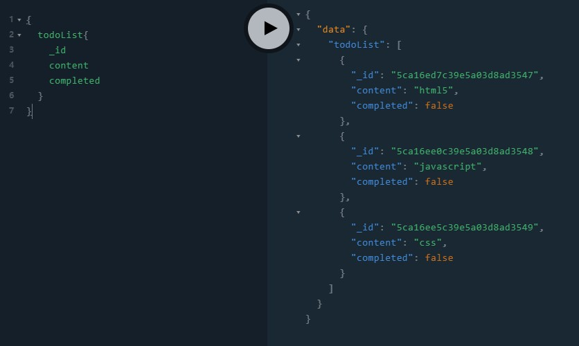

# 什么是GraphQL
[GraphQL](https://graphql.org/),是Facebook开源的一种api查询语言，对查询数据提供了一套完整的描述，客户端可以精准的获取需要的数据，而没有任何冗余



最基础的查询方式如上图，左边是请求，右边是响应，我希望获取`todoList`这个集合，集合里的每一个元素都包括`_id,content,completed`字段，服务端返回的数据就是我请求需要的数据，不会多也不会少

## GraphQL的基础概念——Query
``` graphql
    type todo {
        _id: ID!
        content: String!
        completed: Boolean!
    }
```
- `todo`表示这是一个GraphQL的对象
- `_id`、`content`和`completed`是`todo`中的字段，`ID`、`String`、`Boolean`都是graphql内置的类型
- `String!`表示这个字段的值为`String`类型且不可为空

接着创建一个查询
``` graphql
    type Query {
        todoList: [todo]!
    }
```
- `Query`和`Mutetion`都是GraphQL的关键字，一个代表查询，一个代表变更，在这里使用了`Query`创建了一个查询
- `[todo]!`表示字段`todoList`的值是一个上面定义的`todo`类型的数组，`[todo]!`表示这个字段要么是空数组`[]`，要么是元素为`todo`的数组`[todo,todo,...]`

## GraphQL中的数据类型

- `Int`: 有符号的32位整数
- `Float`: 有符号的双精度浮点值
- `String`: UTF‐8的字符串
- `Boolean`: 布尔
- `ID`: 唯一的标识，在序列化为`String`时表示人类不可读的

还可以[自定义类型](https://www.apollographql.com/docs/apollo-server/features/scalars-enums#custom-scalars)


## 搭建GraphQL服务器
了解了查询，就来创建一个GraphQL的服务器吧
我使用的是[Apollo GraphQL](https://www.apollographql.com/)，这是一个非常完整的GraphQL的实现，包括了客户端和服务端
node服务器使用的是[koa](https://koajs.com)
现在就开始吧

首先创建一个项目，然后安装以下依赖
> `npm i -S apollo-server-koa graphql koa`

根目录创建`app.js`文件
``` javascript
const Koa = require("koa");
const { ApolloServer } = require("apollo-server-koa");

const { gql } = require("apollo-server-koa");

// 定义从服务器获取数据的graphql方法
const typeDefs = gql`
  type todo {
    _id: ID!
    content: String!
    completed: Boolean!
  }
  type Query {
    todoList: [todo]!
  }
`;

const server = new ApolloServer({
  // 使用gql标签和字符串定义的graphql的DocumentNode
  typeDefs,
  // 开启mock
  mocks: true
});

const app = new Koa();

// applyMiddleware将graphql服务连接到koa框架
server.applyMiddleware({ app });

app.listen({ port: 4000 }, () =>
  console.log(`🚀 Server ready at http://localhost:4000${server.graphqlPath}`)
);

```
接着运行`node app.js`，在`http://localhost:4000/graphql`就能看见`apollo server`提供的`playground`了

**查询**
``` graphql
{
  todoList{
    _id
    content
    completed
  }
}
```
在左边输入上方的查询，右边就会出现mock的数据了

### 添加resolvers
resolvers是用于解析typeDefs查询的解析器，是一个键为`type`名，值为一个函数的映射
在`app.js`中添加`resolvers`
``` javascript
// ...
// 创建一个数据
const data = [
  {
    _id: "5ca16ed7c39e5a03d8ad3547",
    content: "html5",
    completed: false
  },
  {
    _id: "5ca16ee0c39e5a03d8ad3548",
    content: "javascript",
    completed: false
  },
  {
    _id: "5ca16ee5c39e5a03d8ad3549",
    content: "css",
    completed: false
  }
];
// resolvers
// Query对应查询，todoList是一个函数，返回的是数据
// 可以写异步函数，用于真实的数据库查询
const resolvers = {
  Query: {
    todoList: () => data
  }
};
// 添加resolvers，取消掉mocks
const server = new ApolloServer({
  typeDefs,
  resolvers,
});

const app = new Koa();
//...
```
再次查询，返回的结果就是`data`的数据了

## GraphQL的基础概念——Mutation
Mutation可以对应REST API中的CRUD,一个简单的`mutation`如下
在`typeDefs`中增加
``` graphql
    type updateResponse {
        success: Boolean!
        todoList:[todo]!
    }
    type Mutation {
        addTodo(content: String): updateResponse!
    }
```
这是一个Mutation的操作，增加一个`todo`项，返回一个`updateResponse`对象
- `addTodo(content: String)`接收一个为`String`类型的参数
- `updateResponse`值包括一个键名为`success`值为`Boolean`和一个键名为`todoList`值为`todo`的数组

### 在playground中执行
**修改resolvers**
``` javascript
const resolvers = {
    Query: {
        todoList: () => data
    },
    Mutation: {
        addTodo: (_, { content }) => {
            console.log(content);
            data.push({
                _id:Math.random().toString(36).substring(3),
                content,
                completed:false
            });
            return { success: true, todoList:data };
        },
    }
};
```
函数中具体的参数可查阅[Resolver type signature](https://www.apollographql.com/docs/apollo-server/essentials/data#type-signature)

**执行**
``` graphql
mutation{
  addTodo(content:"css"){
    success
    todoList{
      _id
      content
      completed
    }
  }
}
```
`mutation`表示这是一个`mutation`操作，操作名为`addTodo`，接收一个名为`content`类型为`String`的参数，返回的数据是`success`和`todoList`

在nodejs的控制台能看见console出来的参数

## 在客户端中使用GraphQL

官方提供了包括`react`、`react-native`、`vue`、`augular`、`native-ios`...等
[在creact-react-app中使用](https://www.apollographql.com/docs/react/essentials/get-started)

虽然官方提供了组件模式的`Query`和`Mutation`组件，不过我在学习过程中，用的还是直接以JS写的方法模式,[Client api参考](https://www.apollographql.com/docs/react/api/apollo-client)

在`create-react-app`的项目中安装依赖

`npm install apollo-boost react-apollo graphql --save`

创建`client.js`,并在`package.json`中增加`proxy`
``` javascript
import ApolloClient from "apollo-boost";
const Client = new ApolloClient();
const getList = async () => {
    return await Client.query({
        query: gql`
            {
                todoList {
                    _id
                    content
                    completed
                }
            }
        `
    });
};
const add = async content => {
    return await Client.mutate({
		// 参数,content对应的下面的$content
        variables: { content },
        mutation: gql`
            mutation add($content: String!) {
                addTodo(content: $content) {
                    success
                    todoList{
                        _id
                        content
                        completed
                    }
                }
            }
        `
    })
};
export {getList,add};
```

## 提供IDE支持
我使用的是webstorm是一款集成功能非常强大的IDE，在plugins里搜索安装`JS GraphQL`

**导出`schema.json`**
- `npm install -g apollo-codegen`
- 客户端根目录执行
`apollo-codegen introspect-schema http://localhost:4000/graphql --output graphql.schema.json`

webstrome就会提供非常智能的graphql代码格式化和补全功能了

## Demo

学习过程中写了2个demo
[客户端](https://github.com/zhangyu1818/todolist-graphql)
[服务端](https://github.com/zhangyu1818/koa-graphql-mongodb)

不懂的地方依旧很多，文档是英文的又特别复杂，路漫漫其修远兮~
不知何什么时候才能搭一个基于graphql的博客呢，wordpress又慢又重，最主要的还是看不懂……
