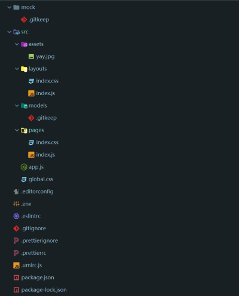

## 通过脚手架创建项目

> yarn create umi

创建可选插件 ant design、dva 等。

umi.js 创建的项目，最大的特点就是集成了 dva 做数据管理和路由跳转，自带 mock 拦截，约定式路由，支持组件动态加载，支持 css module，第一次用感觉很方便，可能是我太菜，用 create-react-app 得搭建老半天。

## 项目结构



- **mock** 放入 mock 的 js 文件
- **assets** 静态资源目录
- **layouts** 全局布局的页面，pages 的页面就是填入全局布局的 slot 插槽部分
- **models** dva 的数据管理目录
- **pages** 页面，也就是填入 layouts 的页面，我们需要写的各种功能的页面
- **.umirc.js** 配置文件
- 其余文件多半不知道干啥的…

## mock

js 放入 mock 文件夹即可，不需要额外配置，请求时会拦截对应的请求

```javascript
// 代码格式：
export default {
	// GET —— 请求方式  /api/data —— 请求路径，后面的对象就是返回的值
	// 请求方式也可以写 POST,PUT,DELETE···
  'GET /api/data': {
    message: 'success',
  },
  'POST /api/data':...,
};
```

## models

存放 state、effects、reducers 等文件，具体可参考[dva.js](https://dvajs.com/guide/introduce-class.html#model-%E5%AF%B9%E8%B1%A1%E7%9A%84%E5%B1%9E%E6%80%A7 "dva.js")，文件结构也可参考[dva.js 初探索](http://zhangyu1818.com/2018/10/30/dva-js-%E5%88%9D%E6%8E%A2%E7%B4%A2/ "dva.js初探索")。
这个文件夹的 js 文件都是自动配置引入的，不需要配置，自动会在 redux 里，根据文件名或者 namespace 做 redux 的 store 对象的 key 值。

## pages

用来写 react 的页面了，支持组件懒加载，css module，可以说是非常的方便了。pages 里的文件会根据 umi 的路由规则自动生成路径。

## 约定式路由

##### 基础路由

感觉在小项目里很好使用，不需要配置 routes，以文件夹为 url 地址

```
+ pages/
  + users/
    - index.js
    - list.js
  - index.js
```

umi 会自动生成 routes 配置

```javascript
[
  { path: "/", component: "./pages/index.js" },
  { path: "/users/", component: "./pages/users/index.js" },
  { path: "/users/list", component: "./pages/users/list.js" },
];
```

如果 js 文件名为 index，则不会创建以下一级路径，否则会以文件名创建路径，如上述的 list.js

##### 动态路由

```
+ pages/
  + $post/
    - index.js
    - comments.js
  + users/
    $id.js
  - index.js
```

```javascript
[
  { path: "/", component: "./pages/index.js" },
  { path: "/users/:id", component: "./pages/users/$id.js" },
  { path: "/:post/", component: "./pages/$post/index.js" },
  { path: "/:post/comments", component: "./pages/$post/comments.js" },
];
```

umi 里约定，以`$`为前缀的目录或文件为动态路由
除了这两种，还有**可选的动态路由**、**嵌套路由**、**通过注释扩展路由**、**权限路由**，具体参考官方文档[umi.js 路由](https://umijs.org/zh/guide/router.html#%E7%BA%A6%E5%AE%9A%E5%BC%8F%E8%B7%AF%E7%94%B1 "umi.js路由")。
如果项目比较大，个人觉得还是手动配置路由文件来的实在。

## 路由跳转

#### Link

###### 声明式

```javascript
import Link from "umi/link";

export default () => {
  <div>
    /* 普通使用 */
    <Link to="/list">Go to list page</Link>
    /* 带参数 */
    <Link to="/list?a=b">Go to list page</Link>
    /* 包含子组件 */
    <Link to="/list?a=b">
      <button>Go to list page</button>
    </Link>
  </div>;
};
```

###### 编程式

```javascript
import router from 'umi/router';

// 普通跳转，不带参数
router.push('/list');

// 带参数
router.push('/list?a=b');
router.push({
  pathname: '/list',
  query: {
    a: 'b',
  },
});
# 对象且不包含 pathname 会报错
router.push({
  query: {}
});
```

#### NavLink

用做导航使用，在路径匹配时会自动加上样式

```javascript
import NavLink from "umi/navlink";

<NavLink to="/home" activeClassName="active-link">
  Home
</NavLink>;
```

#### Redirect

重定向

```javascript
import Redirect from "umi/redirect";
<Redirect to="/login" />;
```

## 动态加载组件

基于[react-loadable](https://github.com/jamiebuilds/react-loadable "react-loadable")，我也只在列表图片懒加载使用过，有空再研究。

```javascript
import dynamic from 'umi/dynamic';

// 延时 1s 渲染的组件。
const App = dynamic({
  loader: () => {
    return new Promise((resolve) => {
      setTimeout(() => {
        resolve(() => <div>I will render after 1s</div>);
      }, /* 1s */1000);
    }));
  },
});

// 或者用 async 语法
const delay = (timeout) => new Promise(resolve => setTimeout(resolve, timeout));
const App = dynamic({
  loader: async function() {
    await delay(/* 1s */1000);
    return () => <div>I will render after 1s</div>;
  },
});
```

最近要用 ant design pro，所以不得不学习 umi，个人觉得 umi 是一个很方便快速的应用框架。
目前只能记录下这些已学习的内容，更多的内容和配置参照[umi.js 官方文档](https://umijs.org/zh/guide/ "umi.js官方文档")。
react 确实好难啊，真是佩服写这些框架的牛皮哥！
