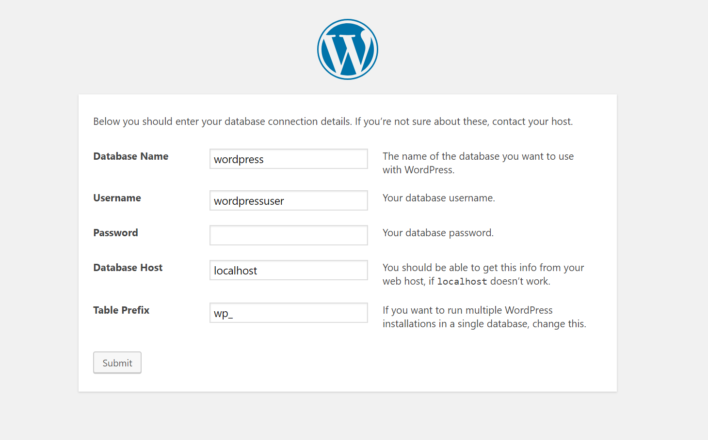
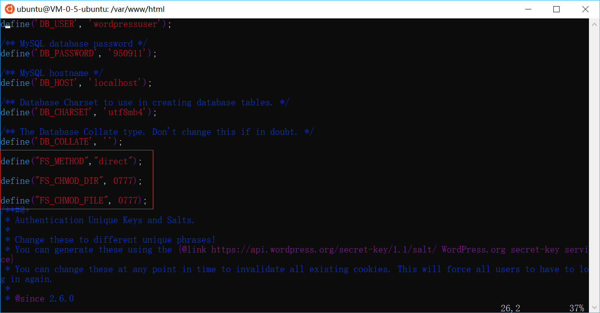

> 腾讯云新用户白菜价服务器，1核1g一年半只要96，你敢信，我这个站用了券270才舍得买的
买了个，准备给别人用，但是忘记国内主机要备案了，只有闲置了
写个建站复制粘贴的玩意儿，仅供参考！

我这个站，也是到处搜刮，凭借一点皮毛的linux命令，复制粘贴，搞好了
以前用的hexo，简单倒是简单，但是也太简单了，还是这种带后台的舒服

建议使用xshell来连接远程主机，不过自从发现了wsl以后，windows内嵌的ubuntu多舒服，新手之逼格(滑稽)

------------
### 安装
1. 先装上apache，现在通过ip地址访问，可以看见apache的界面了
> `sudo apt-get install apache2 -y`

2. 装上php
>`sudo apt-get install php7.0 -y`

3. 安装php的相关组件
>`sudo apt-get install libapache2-mod-php7.0`

4. 安装mysql的服务，安装过程中需要设置mysql的密码，后面新建数据库需要使用
> `sudo apt-get install mysql-server -y`

5. 安装php mysql组件
> `sudo apt-get install php7.0-mysql -y`

6. 安装phpmyadmin
>`sudo apt-get install phpmyadmin -y`

7. 开启权限,重启mysql和apache
> `sudo a2enmod rewrite`
`sudo service apache2 restart`
`sudo service mysql restart`

8. 进入mysql
> `mysql -u root -p`

9. 创建一个叫wordpress的数据库
> `CREATE DATABASE wordpress;`

10. 为数据库创建一个用户
> `CREATE USER wordpressuser;`

11. 给用户设置密码，后续要使用
> `SET PASSWORD FOR wordpressuser= PASSWORD("950911");`

12. 给用户权限，密码和上面设置的要一样
> `GRANT ALL PRIVILEGES ON wordpress.* TO wordpressuser IDENTIFIED BY"950911";`

13. 生效配置
> `FLUSH PRIVILEGES;`

14. 退出mysql
> `exit;`

15. 下载wordpress
> `sudo wget https://wordpress.org/latest.zip`
我这里是使用的英文版的，因为中文版文章出现中文链接会找不到地址，并且我也不知道怎么改

16. 解压wordpress
> `sudo unzip latest.zip`

17. 将wordpress的文件移动到`/var/www/html/`目录
> `sudo mv wordpress/* /var/www/html/`

18. 修改目录权限
> `sudo chmod -R 777 /var/www/html/`

19. 将apache指定到index.html
> `sudo mv /var/www/html/index.html /var/www/html/index~.html`

20. 重启apache
> `sudo service apache2 restart`

再次访问ip地址，应该可以看见欢迎页面了，下一步对照着上面配置的信息进行填写



------------


### 修改wordpress 里 plugins 无法使用的问题

1. cd到目录
>`cd /var/www/html`

2. 修改文件
> `sudo vi wp-config.php`



如图，找个地方添加上框住的三行，按insert修改
``` php
define("FS_METHOD","direct");

define("FS_CHMOD_DIR", 0777);

define("FS_CHMOD_FILE", 0777);
```
3. 按`esc`输入`:wq`保存并退出
