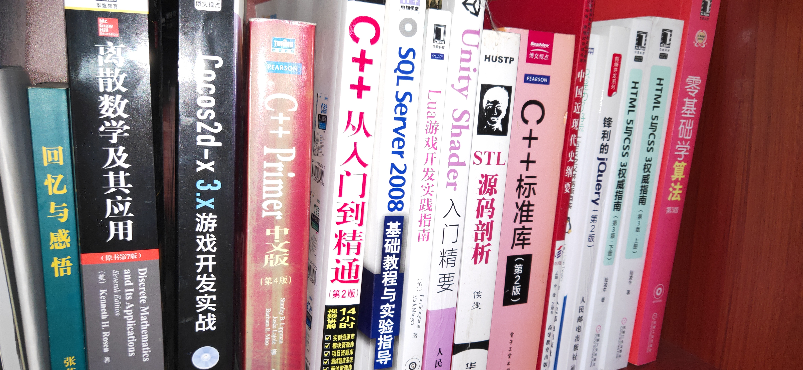

一直以来念叨着要好好总结一下，然而总是忘记，都快过小半年了，再来总结一下，哈哈

## 我的 2018

### 书籍

1. 深入学习`javascript`，读了[Nicholas](https://humanwhocodes.com/)的《JavaScript 高级程序设计》，不懂的地方有反复阅读，当时记忆蛮深的，现在想想有些又忘记了
2. 同样也是 Nicholas 的《深入理解 ES6》,其中的`Proxy`和`Reflect`还是马马虎虎，偶尔也有再品位一下，还是有一些内容不懂，可能是没怎么用过的原因
3. 一本简单的算法入门书籍《算法图解》，我觉得还挺不错的，内容科普向比较强，以前读书的时候学过`python`，用`js`照着里面的代码敲了敲，还记得当时我觉得里面`python`的快排挺简单又好理解，结果过了一段时间就有人说阮一峰的快排错了，书里确实也是阮大大的方法，我觉得挺好，后来研究了一下，可能空间复杂度有些额外的占用
4. 程墨的《深入浅出 React 和 Redux》，个人觉得挺不错，当时已经会`React`了，有些懂了的地方加深了理解
5. 朴灵的《深入浅出 nodejs》，当时可能是想深入学习下 node，然而看了 30%左右，实在是看不懂啊 😂，就没看了
6. 寻思着想写一个博客后台管理系统，读了《Node 与 Express 开发》，后来比较忙，就没读了，不过我这个写博客管理系统的想法还是没实现 😂
7. 简单的学习了`Linux`的操作，所以读了 linus 的自传《只是为了好玩》（这两者好像没有关系 😝），看完觉得他真的太牛皮了，可能这就是天才吧,记得最清楚的是他说乔布斯邀请他去苹果公司，他心里想「我觉得 mac os 的内核就是个垃圾」，哈哈哈，是真的牛皮，崇拜这样的巨佬，话说我也好想拥有一台 mac，就是太贵了
8. 地铁上的闲暇时间读完了阮一峰的《ECAMScript 6 入门》，其中有些东西现在还没成标准 😂
9. css 还是挺重要，读完了《CSS 揭秘》，我觉得这本书真的特别棒
10. 快读完了《生如夏花》

    好像没有了，打到这里，突然想起了什么 😵

想不到吧，看上去我是个前端，实际上我大学是搞游戏开发的 😋，但是读过的只是寥寥几本，少壮不努力啊~反而去年可能是上班的原因，读的书是我长这么大读了最多的了 🙈
如果大学把这些书都看了该多好，不过这两三年倒是也把大学学的全忘了，只剩工作用的了，其实我挺喜欢`C#`的,如果当年的我签了合同，可能现在还在做游戏开发吧~，失不再来咯！

### 学习

1. 全面进入框架的领域，抛弃了`jQuery`
2. 学习了`Vue`生态
3. 学习了`React`生态，`JSX`的语法真是让我欲罢不能
4. 跟随潮流，学习了`Typescript`
5. 学习`webpack`
6. 学习微信小程序
7. 换了 oppo find x，入门了一下`React Native`，感觉这个好复杂 😂
8. 因为使用了`ant design pro`，所以学习了`dva`和`umi`
9. 各种奇怪的`js`库...

### 做的项目

- 工作 1. 当然还是各种静态页面了 2. 小程序，用的`Taro`框架，当时坑好像还挺多，现在的版本应该很不错了吧 3. 后台系统的开发，用了`ant design pro`
- 个人 1. 当时在学习`vue`，慕课购入了黄轶的「vue 音乐 app」,模仿着做了一半,倒是也放服务器上了,[demo](http://45.32.40.170:3001/index.html) 2. 学了`ts`，寻思着好久没用`vue`，就写一个[vue-ts-todolist](http://45.32.40.170:3000) 3. 模仿 qq 音乐，写了一个[react-music](http://45.32.40.170:3003)

qq 音乐换接口了，所以都不能播放了，而且当时找工作碰壁，很气馁，觉得自己很差劲，把项目源码都删了 😭

### 总结

显然 2018 基本处于迷茫期，浪费了很多时间，浪费了很多时间……
感觉自己特别笨，有去 Leetcode 做题，做了二十多道不会了，放弃了，很后悔大学的时候没有坚持学习算法

## 我的 2019

2019 已经过了一小半了，真是时光荏苒，今年大概最大的领悟就是光学不练是没有用的，为了更牛皮，我应该拼命的去敲更多的代码

- 学习 1. 一直在用`webpack`,有啥不懂就搜，没有系统的学习，所以慕课购入了`webpack4`的课程，发现英语好真的牛皮，前面很几章老师就是把官方文档翻译了一下，把官方代码敲了一下，总结了一下 2. 学习`react`的服务端渲染，在慕课买了课程，没看完，有一段时间了 3. 学习`graphql`
- 项目 1. 用`apollo-server`写了一个 Todolist 的[客户端](https://github.com/zhangyu1818/todolist-graphql)和[服务端](https://github.com/zhangyu1818/koa-graphql-mongodb) 2. 用`ts`写了一个原生[轮播图](https://github.com/zhangyu1818/simple-carousel) 3. 基于`codemirror`和`markdown-it`写了一个 react 的[markdown 编译器](https://github.com/zhangyu1818/react-markdown-editor) 4. 用`ts`和`hooks`写了一个[react-music-app](https://github.com/zhangyu1818/react-music-app)

### 2019 Todo

1. 更深入的学习`javascript`，比如叫我实现一个`call`,`apply`,`promise`,`generator`迭代器，我还真的毫无头绪
2. 更深入的学习`React`，现在不敢说精通,但还是能熟练使用，有自己的逻辑和风格了，之前看`ant design`的源码，真的太精妙了，根本看不懂，希望今年的我能向着源码方向进发！！！
3. 实现一个`React`服务端渲染前端，有后台管理系统的博客，原因是`word press`真的是太慢太慢了，又笨又重，关键是代码还看不懂，实现一个轻量的博客系统很有必要，考虑的技术栈是`React+koa+mongodb+graphql`
4. 学好`ts`
5. 想跳槽一个好的，懂技术的公司，现在的公司虽然挺好，965 不加班，不过只有我一个前端，很多东西后端的都不能理解，技术也比较老旧，希望能去一个好技术的大公司，我想学习更多的知识，用更多新的东西！

这几个月我真的特别努力，一天除了睡觉吃饭，90%的时间都在写代码，想努力学习，想赚更多的钱
一些人觉得我厉害，但是他们不知道我付出了多少，别人可能半天就会的东西，我要坐上一天，数学又差，英语也撇，读书不努力的后果啊 😭
努力一定有收获的，希望今年能够不留遗憾！
